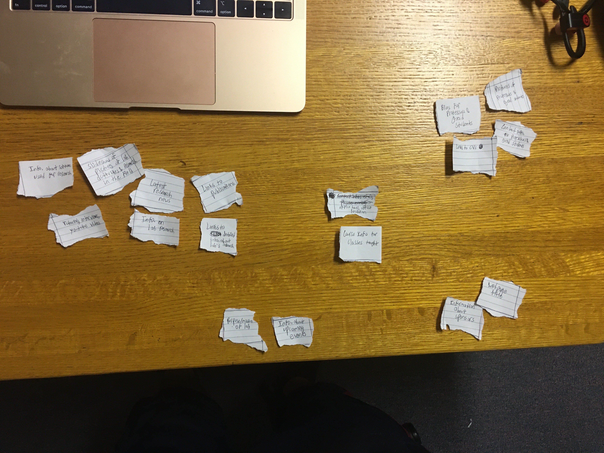
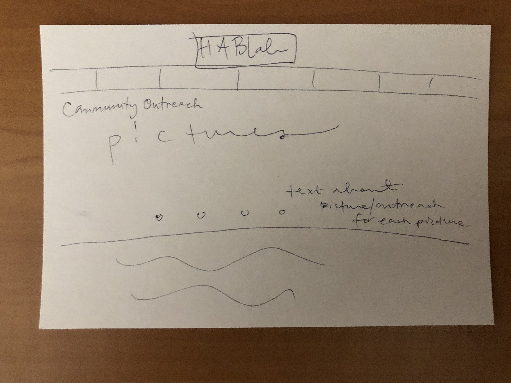
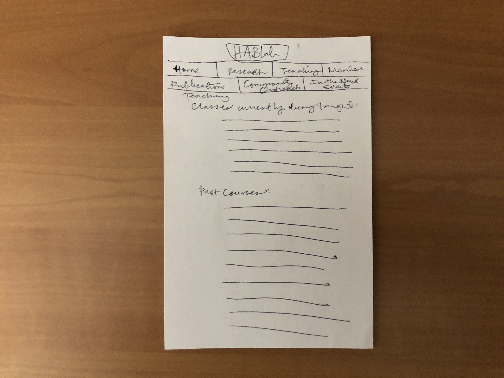

# Project 4 - Design & Plan

Be clear and concise in your writing. Bullets points are acceptable.


# Planning

## Client Description (Milestone 1)

Our client is The HABLab (Human and Animal Bone Laboratory), which is a group which works to publish and spread research associated with its staff. As part of their undergraduate and graduate student recruitment, they are looking for a website which will detail this research and opportunities for future research.
Professor Matthew Velasco will be the main contact for our website. He came to Cornell University in 2016 and is currently the Undergraduate Advisor of archaeology. He has a P.h.D from Vanderbilt and most of his research specializes in bioarchaeology, as well as the courses he teaches and the grad students he advises.


## Site's Purpose (Milestone 1)
The purpose of the website is to provide information about the Human and Animal Bone Lab (HABLab) and the research that comes out the lab and its members. It also serves to advertise the programs of bioarcaheology and zooarchaeology to potential undergraduate and graduate students.

## Client Meeting Notes (Milestone 1)


## Client Needs and Wants (Milestone 1)
Needs/Wants: Research info
- **Needs and Wants**
  - Information about research and publications
  - Slideshow of pictures from the lab/research in the field
  - Latest research news
- **Design Ideas and Choices**
  - Create picture slideshow using javascript of research in the field
  - Have appropriately organized pages that could either separate or include related content to research and publications.
- **Memo**

Need/Want:
- **Needs and Wants**
  - Bios of the professors and grad students
- **Design Ideas and Choices**
  - Use CSS to organize bio descriptions and pictures of the people of the Lab
  - Separate grad students and professors
- **Memo**

Need/Want:
- **Needs and Wants**
  - lab's community outreach info
- **Design Ideas and Choices**
  - Include a separate page for this info, possibly also with a picture slideshow
- **Memo**

Need/Want:
- **Needs and Wants**
  - slideshow of relevant research photos
- **Design Ideas and Choices**
  - Have a home page to house the slideshow and help draw users in
- **Memo**

Need/Want:
- **Needs and Wants**
  - Information about the courses that they teach
  - help recruit more students to their field and those courses
- **Design Ideas and Choices**
  - Section on courses they teach, including links
  - Links to email or contact
- **Memo**

## User(s) (Milestone 1)
> Tell us about the users (target audience) for this website.

* The target audiences for this website are undergraduate and graduate students interested in the professors' and grad student research.

## Discovering Users' Needs (Milestone 1)
> You'll need to discover your users' needs. Talk to them! Document what you've learned about them. When talking to your users, take notes and include those notes here.

- To better understand the things which a user would want to find on a website like ours, we spoke to an undergraduate student majoring in Classics who has taken part in Archeological research in the past. We spoke with him about his process in finding a research organization to get involved with, and summarized important responses below:


## Users' Needs (Milestone 1)
> Analyze the users' needs and wants from your notes above. List each need/want below. There is no specific number of needs required for this, but you need enough to do the job.
> **Note:** These are probably *not* the needs of your client.

Need/Want: [Professors' and graduate TAs' bio & picture]
- **Needs and Wants** [What do the users need and want?]
  - The user needs information about the background of the professors and graduate TAs and their field of study.
- **Design Ideas and Choices** [How will you meet those needs and wants?]
  - The professor's and graduate TAs' bio and pictures will be located on a separate page of the website.
- **Rationale & Additional Notes** [Justify your decisions; additional notes.]
  - None.

Need/Want: [Professors' and graduate TAs' research]
- **Needs and Wants** [What do the users need and want?]
  - The user wants information about research being conducted by the professors and graduate TAs.
- **Design Ideas and Choices** [How will you meet those needs and wants?]
  - The professor's and graduate TAs' research areas will be documented on the research page of the website.
- **Rationale & Additional Notes** [Justify your decisions; additional notes.]
  - None.

Need/Want: [Professors' and graduate TAs' contact information]
- **Needs and Wants** [What do the users need and want?]
  - The user wants information on how to contact the professors and graduate TAs in order to potentially get involved with the research being conducted.
- **Design Ideas and Choices** [How will you meet those needs and wants?]
  - The professors' and graduate TAs' contact info along with methods to reach the department in general will be provided on the home page and bio page of the website.
- **Rationale & Additional Notes** [Justify your decisions; additional notes.]
  - None.

Need/Want: [Professors' courses]
- **Needs and Wants** [What do the users need and want?]
  - The user wants information on the courses the professors have taught in the past and are currently teaching or will teach.
- **Design Ideas and Choices** [How will you meet those needs and wants?]
  - The professors' courses will be listed in a separate page on the website.
- **Rationale & Additional Notes** [Justify your decisions; additional notes.]
  - None.

Need/Want: [Research and lab picture]
- **Needs and Wants** [What do the users need and want?]
  - The user wants visual information related to the lab and research being conduct.
- **Design Ideas and Choices** [How will you meet those needs and wants?]
  - The lab and research related pictures will be uploaded on the homepage of the website through a slideshow format.
- **Rationale & Additional Notes** [Justify your decisions; additional notes.]
  - None.

## User Testing Plan (Milestone 1)
> Plan out your tasks for evaluating whether your site will meet the needs of the users. These must be actual user testing tasks. Tasks are not questions!

1. You're curious about what kind of work the archaeology/anthropology programs do, which can help you decide if you want to take their classes. You want to find information about the research at the HABLab.

2. Since you might want to take classes associated with the lab, you want to know more about the background of the people at the HABLab, specifically the professors.

3. You want to get involved with the work at the HABLab or something related to the research they do. Find contact information for one of the members of the lab.

4. You are really interested in the research that they do and want to know how you can take classes that relate to the work at the HABLab.


## Content (Milestone 1)
> Plan out your site's content (text, images, etc.). Make a list of **all** the content you will need. This list should be **exhaustive**.

- Course information for classes taught
- Latest research news
- Slideshow of pictures of lab activities and research in the field
- Information about sponsors
- Links to publications
- Information about software used for research
- Tutorials, interviews, youtube videos
- Contact Information: email, phone number, office hours, office location
- Webpage Title
- Bios for professors and grad students
- Links to CVs if the professors/grad students want that
- Contact information for professors and grad students
- Pictures of professors and grad students
- Information on lab's research
- Links to information about lab's research
- Purpose/mission of Lab
- Information about any upcoming events related to the department and/or lab


## Interactivity Ideas (Milestone 1)
> Come up with some idea for interactive features for your site.

* Picture slideshow of the Professors' and graduate TAs' research and lab equipment.
* Form to gather students interested in getting involved with the research.


# Design & Evaluation

## Design Process (Milestone 1)
> Document your design process. Show us your card sorting. Design your navigation from the card sorting. Outline your navigation. Describe your theme. Show us sketches of your site (mobile and desktop versions). etc.

All of the different items that were used in card sorting are essentially pieces of
content that we plan to incorporate into the website.


The first round of card sorting involved the following categorization:

* research-related items (leftmost group)
* Information relating to the personnel who run the lab (rightmost group)
* Course and curriculum-related information (middle group)
* Information that could possibly be present in every page (bottom right group)
* Content that informs users about what the HAB lab is about and updates them on upcoming events (bottom left group)



We were not satisfied with the results of the first card sorting primarily because the
resulting content organization would result in not enough pages and in the congestion
of content in the page corresponding to "research-related items." Thus, the
second round of card sorting involved the following categorization:

* Information that could possibly be present in every page (bottom right group)
* Information relating to the personnel that run the lab, which also includes links
to publications of some of their research studies as well as any new research study
that they might be conducting. In addition, links to the pages that pertain to
information about the courses that these personnel are also included (top left group)
* Course and curriculum-related information (bottom left group; includes "course
info for classes taught")
* "Course info for classes taught" is in both the top left and bottom left groups
because links relating to the content can be accessible from the page corresponding
to the top-left in order to specifically get to the content that corresponds to
classes and curricula. (middle left card)
* Information that is solely research-based. In other words, it gets straight to
the point and is focused solely on the facts and details of the different research
studies. This includes links to publications and links on more thorough explanations
and examination of the research studies. (top middle group; includes " links to publications")
* "Links to publications" is in both the top middle and top left group because publications
genuinely deserve to be an essential part of content surrounding a professor's or
graduate student's bio. In addition, the research information added into the "research" page
would depend heavily on what can be found the publications-- which, thus, marks
the significance of including links to them ( card between top left group and
top middle group).
* Content that textually informs users about what HAB lab is as well as providing
visual examples from past events or research studies (2nd most bottom-right group)
* "Info about upcoming events" deserves to be on its own to simply avoid congestion
as well making it obvious to others that there are actual events that the lab/department
hosts of which one can partake in (top right group)
* Info regarding the was in which the lab personnel obtain their data or conduct
their research studies. This can include information about any software utilized
or informative videos, tutorials, and/or even informational interviews (2nd most bottom left group)


Although we were definitely pleased with the results from the second round of
testing, we decided to change a few things in order to minimize congestion of content,
as well as maximize user visual experience-- in order to avoid boring them with too much text.


In order to avoid typing the same results from the second round of card sorting,
we will simply state the main differences between round 2 and round 3 of card sorting:

* The top right group came into being because of the fact that putting a slideshow
regarding information about past activities and research studies could further
stimulate a user's desire to attend an event or get involved in some
research opportunities; in other words, it could serve to enhance the text regarding
upcoming events and even increase the turnout rate of those events.
* "Latest research news" has become its own group in order to avoid the congestion
of content. This page requires constant updates whenever new pieces of information
arise from various studies. Thus, there is enough "news" content to sufficiently
fill out a whole page.
* P.S. Disregard the fact that the "Tutorials, interviews, and youtube videos"
card is sideways; it belongs to the same group as only "Info. about software
used for research"-- nothing else.


Given the content that was available, the needs and wants of the users, and the
objective of our client (HABlab), these are the changes that came out of the
last round of card sorting:

- The justification utilized for the organization of this final round of card
  sorting is essentially the same as what was given in the prior rounds. Moreover,
  this final round is more of an update on the content that we have available
  out of the content that we originally believed we would have available to us.

- There are a total of six pages: index.html, research.html, courses.html, members.html,
members_grad.html, and news.html.


- Top row:
  - The top two cards represents content that should and will be available on each
  page of the website.

- Middle row:
  - The leftmost card represents the content that will be in the home page; it
    is followed by a vertically-placed card because both the home page and research page,
    which is the card following the first vertically-faced card,  
    will contain images pertaining to HABlab-- in terms of research and events.
  - The reason why the card to the immediate right of the research card is facing
    vertically is because both the research page and news page will contain information
    about the latest research projects.

- Bottom row:
  - The left group represents the content that will be in the courses page as it
    is essential information to provide students with in terms of academic opportunities
    and availability.
  - The right group represents the content that will be in both the members page
    and the members_grad page. The justification surrounding this decision is
    essentially the same as before. The only surprise from this organization is
    that we split information and content on members of the HABlab into multiple
    pages in order to avoid congestion once all of the content is available.


> You should show us how your came up with your design and how your iterated on that design; show us the evolution of your design.

> **Note:** Card sorting is used to organize your site's content. For each piece of content identified in the previous section, write a summary of that content onto a card. Now sort the cards. The grouping of cards provides you with your pages for your website. **Do not write down the pages you want and then "card sort" those. That is not card sorting.**


## Interactivity (Milestone 1)
> What interactive features will your site have? Describe how the interactivity connects with the needs of the clients/target audience.

- One of the user needs is pictures of the research group and their projects. This need can be met by creating an interactive slideshow that users can flip through.


## User Testing (_optional_)
> This testing is optional.

### User 1 - Testing Notes (Milestone 1)


### User 1 (Milestone 1)
> Using your notes from above, describe your user by answering the questions below.

1. Who is your user, e.g., where does the user come from, what is the user's job, characteristics, etc.?
This user is a current student at Cornell who is a pre-med. She recently became more interested in the archeology and anthropology program at Cornell because a number of pre-meds have taken certain archeology and anthropology courses that deal with disease and anatomy. Other than that, she knows little about the department, and mainly focuses the classes she has now in her major: Nutritional Science. However, in future, she would like to more classes outside of her major or considered "fun" at Cornell.

2. Does the user belong to your target audience of the site? (Yes / No)
Yes, this user is part of the target audience. It's not just that they are a student, but they would use the website to learn more about the specific focuses of archaeology they have an interest in. This site would help them learn more about that area, and access research summaries to help them understand the program and see if they want to get more information. They could also use it to find potential courses in archeology that are related to the medicine field, like Osteology or Ancient Health and Disease.

### User 1 - **Desktop** (Milestone 1)
> Report the results of your user's evaluation. You should explain **what the user did**, describe the user's **reaction/feedback** to the design, **reflect on the user's performance**, determine what **re-design choices** you will make. You can also add any additional comments. See the example design journey for an example of what this would look like.

Task: Get an update about the latest research/study.
- **Did you evaluate the desktop or mobile design?**
  - Pick one: desktop
- **How did the user do? Did they meet your expectation?**
  - The user pointed research and believed that would be the page for the relevant information. We intended for them to pick latest news.
- **User’s reaction / feedback to the design** (e.g., specific problems or issues found in the tasks)
  - Since the task was about finding research, they felt the research tab would make the most sense to go to. They were unsure if the latest/recent news tab would be about general news about the lab or also include latest research news.
- **Your reflections about the user’s performance to the task**
  - This is a fair assessment, the latest research can still very reasonably be on the research page, as that could be reasonably updated. We should reflect this in our card sorting and make sure latests news about research would be in both pages to some extent.
- **Re-design choices**
  - Have the new research content be in the research section and have a note or announcement in the news section about it.
- **Additional Notes**

  Task: Write an email to one of the researchers at the lab.  
  - **Did you evaluate the desktop or mobile design?**
    - Pick one: desktop
  - **How did the user do? Did they meet your expectation?**
    - The user was unsure of any page where they could specifically contact the professors.
  - **User’s reaction / feedback to the design** (e.g., specific problems or issues found in the tasks)
    - The emails would be accessible from the page including bios of the HABLab members, but this isn't clear from the sketch design. They also talked about thinking the contact might be on the home page if there was an email for the whole lab instead.
  - **Your reflections about the user’s performance to the task**
    - We will be including clear links to email the members, but it would be good to separate them in some way so they don't get lost the in the content for research bios.
  - **Re-design choices**
    - List the emails under their picture for bios so it's separate but clearly attached to a certain person.
  - **Additional Notes**


    Task: Learn more about the professors who run the Human and Animal Bone Lab.
    - **Did you evaluate the desktop or mobile design?**
      - Pick one: desktop
    - **How did the user do? Did they meet your expectation?**
      - The user pointed to the tab labeled "members" and indicated they would get information about professors from their bios. This was what we expected for this task.
    - **User’s reaction / feedback to the design** (e.g., specific problems or issues found in the tasks)
      - They easily moved through this task and had no issue with understanding where to go or how to find the info.
    - **Your reflections about the user’s performance to the task**
      - Everything for this went as expected, the members page is likely the most separate page in terms of having related content for this site.
    - **Re-design choices**
      - None
    - **Additional Notes**

      Task: Identify related classes.
      - **Did you evaluate the desktop or mobile design?**
        - Pick one: desktop
      - **How did the user do? Did they meet your expectation?**
        - The user went to the teaching/classes tab and said they would find the info there. This was expected.
      - **User’s reaction / feedback to the design** (e.g., specific problems or issues found in the tasks)
        - They did feel that that the design for the classes might be end up too busy, especially if they are all simply listed one after and one and having links to the research.
      - **Your reflections about the user’s performance to the task**
        - The site appears easy to navigate for finding course too. However, we still want to organize the courses page well. If we have a CSS where we bold or underline links, than we'll end up having a long list of bold/underlined things if we link the class list to things like course roster.
      - **Re-design choices**
        - Try to give some white space in between each class, and try to not have too long of a list. We could also space things out by organizing if they are an arkeo vs anthr course.
      - **Additional Notes**
...


### User 2 - Testing Notes (Milestone 1)
> When conducting user testing, you should take notes during the test. Place your notes here.


### User 2 (Milestone 1)
> Using your notes from above, describe your user by answering the questions below.

1. Who is your user, e.g., where does the user come from, what is the user's job, characteristics, etc.?


2. Does the user belong to your target audience of the site? (Yes / No)
> If “No”, what’s your strategy of associating the user test results to your target audience’s needs and wants? How can your re-design choices based on the user tests make a better fit for the target audience?


### User 2 - **Mobile** (Milestone 1)
> Report the results of your user's evaluation. You should explain **what the user did**, describe the user's **reaction/feedback** to the design, **reflect on the user's performance**, determine what **re-design choices** you will make. You can also add any additional comments. See the example design journey for an example of what this would look like.

Task: [TODO: copy task here]
- **Did you evaluate the desktop or mobile design?**
  - Pick one: desktop/mobile
- **How did the user do? Did they meet your expectation?**
  - TODO
- **User’s reaction / feedback to the design** (e.g., specific problems or issues found in the tasks)
  - TODO
- **Your reflections about the user’s performance to the task**
  - TODO
- **Re-design choices**
  - TODO
- **Additional Notes**
  - TODO: Justify your decisions; additional notes.

...


## Final Design (Milestone 1)
> Include the final sketches for each of your pages. These sketches **must** hand-drawn.

**Desktop Design:**





**Mobile Design:**





## Additional Comments (Milestone 1)
> If you feel like you haven't fully explained your design choices, or if you want to explain some other functions in your site (such as special design decisions that might not meet the Project 4 requirements), you can use this space to justify your design choices or ask other questions about the project and process.


---

# Iteration 2

## Client Feedback (Milestone 2)


In our meeting, our contact and representative for the HABLab, Prof. Velasco, approved of the look of our sketches. He pointed out some pages that would no longer be necessary, like publications and community outreach. He also had some suggestions, like a drop-down menu for certain sections, and also having photo galleries for members' research in addition to the homepage.


## Interactivity Plan (Milestone 2)
> Write your interactivity pseudocode here.

Interactivity pseudocode used for the slideshows in both index. html and research.html

```
when DOM is loaded:

  set current image to index 0
  when next button is pressed
  if image is the last image in slideshow/array:
    display first image in slideshow/array
    set current image to index 0
  else
    add 1 to the index of current image
    display the image corresponding to the calculated index


```

## Additional Comments (Milestone 2)
> If you feel like you haven't fully explained your design choices, or if you want to explain some other functions in your site (such as special design decisions that might not meet the Project 4 requirements), you can use this space to justify your design choices or ask other questions about the project and process.

Design decisions meet Project 4 requirements, client's requests and user's needs. The pages listed in the navigation bar help user's know where to find content they are looking for such as research the lab is engaged in/possible research opportunities, background information on the professors in the lab and their areas of interest, contact information for professors, etc.

There is variety in the appearance from page to page. Some pages have pictures and/or slideshows.

In addition, we are using multiple css files in order to design the content/pages which we have designated to ourselves. We will eventually come together and
vote on which common theme to use for the website. We will then incorporate
the thematic elements to our designated pages and utilize a common CSS file.

P.S. We have not received some of the content for the research page yet. Thus,
that is why it only has a bit of styling-- excluding the layout-- and not so much content.

---

# Iteration 3

## Additional Comments (Milestone 3)
> If you feel like you haven't fully explained your design choices, or if you want to explain some other functions in your site (such as special design decisions that might not meet the Project 4 requirements), you can use this space to justify your design choices or ask other questions about the project and process.


---

# Final Evaluation

## Changes Based on Lab 13 Peer Feedback (Final Submission)

-We decided to change the title to just say Human & Animal Bone Lab, instead of Laboratory because the longer title made it two lines- creating a lot of empty space.
-Professor Harms also pointed out that the lines on the current news were a bit harsh, so we got rid of the black outline.
-We also gave the nav bar some extra padding at the top to match the space between the website title and the top of the page.
-Added some titles since some peers said it wouldn't be clear if you were on certain pages.


## User Testing
> If you conducted user testing in Milestone 1, you only need to user test 2 more users. Otherwise, you must conduct user testing with 4 users.

### User 3 - Testing Notes (Final Submission)
> When conducting user testing, you should take notes during the test. Place your notes here.


### User 3 (Final Submission)
> Using your notes from above, describe your user by answering the questions below.

1. Who is your user, e.g., where does the user come from, what is the user's job, characteristics, etc.?

My user is a grad student at Cornell from Alabama. He does research in the business school on how to get people to accept new ideas. He's not well-versed in archeology or anthropolgy nor the department. He mostly takes classes within the business school.

2. Does the user belong to your target audience of the site? (Yes / No)
> If “No”, what’s your strategy of associating the user test results to your target audience’s needs and wants? How can your re-design choices based on the user tests make a better fit for the target audience?

Yes, in that he is a grad student who is interested in research, designs studies, reads a lot about research that has been published and looks up information on professors and their research visible on their websites.


### User 3 - **Desktop** (Final Submission)
> Report the results of your user's evaluation. You should explain **what the user did**, describe the user's **reaction/feedback** to the design, **reflect on the user's performance**, determine what **re-design choices** you will make. You can also add any additional comments. See the example design journey for an example of what this would look like.

Task: Write an email to the members of the lab.
- **Did you evaluate the desktop or mobile design?**
  - Pick one: desktop
- **How did the user do? Did they meet your expectation?**
  - I was surprised and glad he gave some helpful feedback. He wouldn't have fully completed the task, because he missed some important information on the page.

  The task was to send the members of the lab an email. He first hovered over the "members" link on the homepage and then clicked on "professors". He then highlighted the email address of the professor with the mouse and copied it to then paste into an email. Then, he moved the mouse to the "graduates" link on the nav bar under members.

  He copied the email he saw there on the graduates page to then send in an email (hypothetically).

- **User’s reaction / feedback to the design** (e.g., specific problems or issues found in the tasks)
  - The user thought there were only 2 members in the lab to send emails to, based off of what he saw on the web pages under members. He saw that there was only one professor listed on the "professors" page, so when he navigated to the "graduates" page and he didn't see a progress/scroll bar on the right hand side of the page, he thought there was only one graduate student listed as well. There was enough of a visual gap between the two graduate students-- to see the second student, you'd have to scroll, that he didn't notice the second student on the page.

- **Your reflections about the user’s performance to the task**
  - I was surprised he didn't scroll to check for more students, but the reasons why he didn't scroll make sense.
- **Re-design choices**
  - I think it could be helpful to truncate the space between the two graduate students, particularly if it can suggest there is more content without having to scroll down the page.
- **Additional Notes**
  - Not every user will think to scroll (particularly if there is only one professor listed under the plural nav bar page label "professors"). And if possible, it'd be nice not to have to make users scroll to see a bigger suggestion of more content below the first grad student.

Task: Identify the classes related to the researcher's focus.
- **Did you evaluate the desktop or mobile design?**
  - Pick one: desktop
- **How did the user do? Did they meet your expectation?**
  - Yes, he navigated to the teaching page from the members page which the website was on when I handed him the laptop. After reading the teaching page, he clicked back to the members page on the graduate students to double check the research focus of the student. He then clicked back to the teaching page and said, "Anthro 4263, because he says he does zoo archaeology."

  He completed the task as expected.
- **User’s reaction / feedback to the design** (e.g., specific problems or issues found in the tasks)
  - The user didn't have any specific problems or issues completing this task.
- **Your reflections about the user’s performance to the task**
  - Very easy for the user to complete and straightforward based on the design.
- **Re-design choices**
  - None to recommend.
- **Additional Notes**


Task: Get updated on the latest research study.
- **Did you evaluate the desktop or mobile design?**
  - Pick one: desktop
- **How did the user do? Did they meet your expectation?**
  - The user navigated to the research page, read the blurb as he scrolled down. "This seems to be it," he said after reading the information about a research study on the research page.
- **User’s reaction / feedback to the design** (e.g., specific problems or issues found in the tasks)
  - Having research be its own page in the nav bar and then listing information about a research study on the research page made this task straightforward and easy for the user to complete.
- **Your reflections about the user’s performance to the task**
  - The user performed and completed the task as expected.
- **Re-design choices**
  - None to recommend.
- **Additional Notes**


Task: Learn about one of the professors in the research lab.
- **Did you evaluate the desktop or mobile design?**
  - Pick one: desktop
- **How did the user do? Did they meet your expectation?**
  - The user navigated to "members" in the nav bar and then clicked on "professors". He read the information listed about the professor to complete the task.
- **User’s reaction / feedback to the design** (e.g., specific problems or issues found in the tasks)
  - No specific problems found as the user completed the task.
- **Your reflections about the user’s performance to the task**
  - The user performed as expected in completing the task.
- **Re-design choices**
  - None to recommend for this task.
- **Additional Notes**
...


### User 4 - Testing Notes (Final Submission)


### User 4 (Final Submission)
> Using your notes from above, describe your user by answering the questions below.

1. Who is your user, e.g., where does the user come from, what is the user's job, characteristics, etc.?
This user is a student from Oxford University. She is an ambitious student who generally finds all her opportunities online, whether it's school or job-search related. She always does her research about an organization or company before applying to a position or contacting the organization. She's always very thorough and curious about potential growth opportunities.

2. Does the user belong to your target audience of the site? (Yes / No)
No. The user is not necessarily a student interested in archaeology/anthropology. Rather, they are a college student interested in doing research at their own school. By having them user test the website, they can still navigate it how a user from the target website would. For example, this user would still want to learn more about the research a certain program or professor conducts, find out more about the people who do that user, possibly be able to contact the members, and learn about the courses that relate to the research they're interested in.


### User 4 - **Mobile** (Final Submission)
> Report the results of your user's evaluation. You should explain **what the user did**, describe the user's **reaction/feedback** to the design, **reflect on the user's performance**, determine what **re-design choices** you will make. You can also add any additional comments. See the example design journey for an example of what this would look like.

Task: You're curious about what kind of work the archaeology/anthropology programs do, which can help you decide if you want to take their classes. You want to find information about the research at the HABLab.
- **Did you evaluate the desktop or mobile design?**
  - Pick one: mobile
- **How did the user do? Did they meet your expectation?**
  - The user actually took the time to read the home page, then went on to research. This surprised me because I thought they would go straight to the research page first.
- **User’s reaction / feedback to the design** (e.g., specific problems or issues found in the tasks)
  - The user also thought there would multiple research tabs. This was a bit confusing, but they did appropriately complete the task.
- **Your reflections about the user’s performance to the task**
  - I think the user thought there would be "multiple" research tabs in the sense that the members page has a tab for profs and students. While this could be done in the sense of again separating profs and students, the research content for the site does not warrant a separation.
- **Re-design choices**
  - None
- **Additional Notes**

Task: Since you might want to take classes associated with the lab, you want to know more about the background of the people at the HABLab, specifically the professors.
- **Did you evaluate the desktop or mobile design?**
  - Pick one: mobile
- **How did the user do? Did they meet your expectation?**
  - The user mostly met my expectation in that they went to the members tab and hit the professors option in the dropdown menu. They also went to the Teaching page because they believe more information would be there about the professor.
- **User’s reaction / feedback to the design** (e.g., specific problems or issues found in the tasks)
  - The user didn't find any issue, other than wanting to know further about the professor through teaching.
- **Your reflections about the user’s performance to the task**
  - I think the website is slightly limited by the content our client gives us- namely that the bio we have for Professor Velasco of the HABLab may not have all that a student is looking for. But it is good to see that a user can still find needed information in other parts of the site.
- **Re-design choices**
  - None
- **Additional Notes**
  - TODO: Justify your decisions; additional notes.

Task: You want to get involved with the work at the HABLab or something related to the research they do. Find contact information for one of the members of the lab.
- **Did you evaluate the desktop or mobile design?**
  - Pick one: desktop
- **How did the user do? Did they meet your expectation?**
  - The user perfectly followed my expectations. They went to the members page, chose professors, and then saw the email link underneath their picture, and hit the email link on the page.
- **User’s reaction / feedback to the design** (e.g., specific problems or issues found in the tasks)
  - The user thought the email was well-placed and very obvious.
- **Your reflections about the user’s performance to the task**
  - This went smoothly. The drop-down menu seems to really contribute to the ease of this task.
- **Re-design choices**
  - None
- **Additional Notes**

Task: You are really interested in the research that they do and want to know how you can take classes that relate to the work at the HABLab.
- **Did you evaluate the desktop or mobile design?**
  - Pick one: mobile
- **How did the user do? Did they meet your expectation?**
  - The user went to the teaching page and then clicked the link for one of the classes they saw. This went as expected.  
- **User’s reaction / feedback to the design** (e.g., specific problems or issues found in the tasks)
  - The user mentioned that it was hard to read the text since there was a lot of it and it was black against dark blue background.
- **Your reflections about the user’s performance to the task**
  - The teaching page is harder to read, especially with so much text.
- **Re-design choices**
  - Change the font color and sizing or add a white background.
- **Additional Notes**


### User 5 - Testing Notes (Final Submission)
> When conducting user testing, you should take notes during the test. Place your notes here.


### User 5 (Final Submission)
> Using your notes from above, describe your user by answering the questions below.

1. Who is your user, e.g., where does the user come from, what is the user's job, characteristics, etc.?


2. Does the user belong to your target audience of the site? (Yes / No)
> If “No”, what’s your strategy of associating the user test results to your target audience’s needs and wants? How can your re-design choices based on the user tests make a better fit for the target audience?


### User 5 - **Desktop** (Final Submission)
> Report the results of your user's evaluation. You should explain **what the user did**, describe the user's **reaction/feedback** to the design, **reflect on the user's performance**, determine what **re-design choices** you will make. You can also add any additional comments. See the example design journey for an example of what this would look like.

Task: [TODO: copy task here]
- **Did you evaluate the desktop or mobile design?**
  - Pick one: mobile
- **How did the user do? Did they meet your expectation?**
  - TODO
- **User’s reaction / feedback to the design** (e.g., specific problems or issues found in the tasks)
  - TODO
- **Your reflections about the user’s performance to the task**
  - TODO
- **Re-design choices**
  - TODO
- **Additional Notes**
  - TODO: Justify your decisions; additional notes.

...


### User 6 - Testing Notes (Final Submission)
> When conducting user testing, you should take notes during the test. Place your notes here.


### User 6 (Final Submission)
> Using your notes from above, describe your user by answering the questions below.

1. Who is your user, e.g., where does the user come from, what is the user's job, characteristics, etc.?

The user's name is Amelia. Here a few characteristics/facts about her:
* 18 years old
* Freshman at Cornell University
* Undecided in the Collect of Arts and Sciences
* Wants to learn more about archeology in terms of research and classes
* Has a vague idea of what HabLab is and would like to know more about the laboratory and its field work.


2. Does the user belong to your target audience of the site? (Yes)
> If “No”, what’s your strategy of associating the user test results to your target audience’s needs and wants? How can your re-design choices based on the user tests make a better fit for the target audience?


### User 6 - **Mobile** (Final Submission)
> Report the results of your user's evaluation. You should explain **what the user did**, describe the user's **reaction/feedback** to the design, **reflect on the user's performance**, determine what **re-design choices** you will make. You can also add any additional comments. See the example design journey for an example of what this would look like.

Task: You're curious about what kind of work the archaeology/anthropology programs do, which can help you decide if you want to take their classes. You want to find information about the research at the HABLab.
- **Did you evaluate the desktop or mobile design?**
  - Pick one: mobile
- **How did the user do? Did they meet your expectation?**
  - The user quickly clicked on the "research" page and got updated on the latest research going on.
- **User’s reaction / feedback to the design** (e.g., specific problems or issues found in the tasks)
  - The user found that she was able to get the information that she needed without any inconvenience. Apart from that, she really liked the the overall aesthetic of the website.
  - In addition, she was curious regarding why there was only information
    about one project-- rather than there being multiple projects.
- **Your reflections about the user’s performance to the task**
  - Seeing as how she did not dislike anything from what she saw of the
    website and she was easily able to complete the task, I believe that no changes need to arise from the results of
    testing this task.
  - Given that the task was fulfilled rather quickly, this is a good sign
    about the level of transparency this website has.
- **Re-design choices**
  - None
- **Additional Notes**
  - N/A

Task: Since you might want to take classes associated with the lab, you want to know more about the background of the people at the HABLab, specifically the professors.
- **Did you evaluate the desktop or mobile design?**
  - Pick one: mobile
- **How did the user do? Did they meet your expectation?**
  -  The user completed the task without delay or any sort of confusion.
- **User’s reaction / feedback to the design** (e.g., specific problems or issues found in the tasks)
  - The user did not expect there to be a dropdown menu coming out of "members."
    This is not to say that she did not like the dropdown menu, but rather that
    she was simply caught off guard.
  - She found the effect to be very cool and made sure to check out both sections
    of the members page.
  - She found it interesting how we used a greenish color for the members' email
    addresses.
- **Your reflections about the user’s performance to the task**
  - Seeing as how the dropdown menu served as a pleasant surprise for Amelia,
    I believe that it is safe to say that the effect is appropriate for this website
    and adds "flair."
  - The email addresses are a greenish color rather than red in consideration of
    those who are color blind.
  - Again, seeing as how there were no inconveniences or complications, no
    changes are needed.
- **Re-design choices**
  - None
- **Additional Notes**
  - None

Task: You want to get involved with the work at the HABLab or something related to the research they do. Find contact information for one of the members of the lab.
- **Did you evaluate the desktop or mobile design?**
  - Pick one: mobile
- **How did the user do? Did they meet your expectation?**
  - Given that the previous task gave the user some exposure to the contact information
    of the members, this was by far the fastest task out of the four.
- **User’s reaction / feedback to the design** (e.g., specific problems or issues found in the tasks)
  - She found it interesting how we used a greenish color for the members' email
    addresses.
- **Your reflections about the user’s performance to the task**
  - The email addresses are a greenish color rather than red in consideration of
    those who are color blind.
  - Again, seeing as how there were no inconveniences or complications, no
    changes are needed.
- **Re-design choices**
  - None
- **Additional Notes**
  - None

Task: You are really interested in the research that they do and want to know how you can take classes that relate to the work at the HABLab.
- **Did you evaluate the desktop or mobile design?**
  - Pick one: mobile
- **How did the user do? Did they meet your expectation?**
  - The user completed the task without delay or any sort of confusion.
- **User’s reaction / feedback to the design** (e.g., specific problems or issues found in the tasks)
  - The user praised me for giving the course links a different color than the
    rest of the course description as it easily allowed her to identify the links
  - She did not like the fact that the links were opening in the same tab; she
    believed that it would be tiresome and annoying to jump from website to website
    on the same tab.

- **Your reflections about the user’s performance to the task**
  - Although clicking on the links was not really necessary for this task, doing
  so allowed me to find out that the user would prefer that the links opened in
  new tabs rather than in the original one so that she wouldn't have to go back
  and forth between websites.
- **Re-design choices**
  - Links, not including email addresses or those of the navbar, now open on different
    tabs.
- **Additional Notes**
  -Not only did Amelia have a point in her reasoning for disliking links opening
  on the same tab, but Professor Harms had once instructed us that links on websites
  that we make should open on separate tabs.  

## Changes Based on User Testing (Final Submission)
We changed some of the font text to white so it was easier to read, as well as edited the CSS so it would take up less width- again making the text easier to read.

We also changed some of the spacing in between the members of the students page so it would be visible that there were multiple members.

## Final Notes to the Graders (Final Submission)
> 1.

1. The website is cleanly sorted into pages. If you information about a professor or lab member, there's no confusion about what page to go to. Ex: Go to members, and select "students" from the drop down menu.
2. The site incorporates interactivity cleanly with slideshows that reveal more about the HabLab visually.
3. Finally, the site is well-structured to be usuable and still just as visually pleasing on a mobile device. This is suited to young students who might visit websites more on their phone.

- Elegant and professional fonts (Champagne & Limousines Font, Georgia, Serif )
- Assortment of colors that not only makes the website look aesthetically pleasing, but gives off a "professional" vibe
  + Steel-blue background color
  + Black and white
  + Absence of red (or any type of color that people would not be able to see well)
- Absolute transparency and clarity on where the distinct forms of information can be found
  throughout the website


> 2. Tell us about things that don't work, what you wanted to implement, or what you would do if you keep working with the client in the future. Give justifications.

  We would continue to add content to the site, like more research and member blurbs. Especially if we had all of the members of the lab, we would organize the page to simply show the pictures of members in a grid. Then, when you hover over the picture, their bio would show over the image with a white background. This is not feasible now as the amount of members currently does not give a grid shape. We also might implement a slideshow for the home page that is wider and more visually appealing but we don't currently have HABLab photos suited to this style of slideshow.


> 3. Tell us what you, as a team, learned while working on this project.

  As a team we learned how to incorporate many different ideas for CSS, as well coordinate and split up work to do on our own. We definitely also learned the benefit of consistent communication, as we couldn't meet up in person often. When people texted they had just made a change or pushed something, it was very helpful to have those updates.


> 4. Tell us anything else you need us to know for when we're looking at the project.

The HABLab content may seem small, but this actually due to the newness of the HABLab itself. It opened only about a year ago, so much of what would be research or member content actually doesn't exist yet at all, rather than the website lacking the content.

We also conducted three user tests for the final submission. We completed one out of the two optional user tests in the first milestone, so here we only needed to complete one more desktop and two mobile tests.
