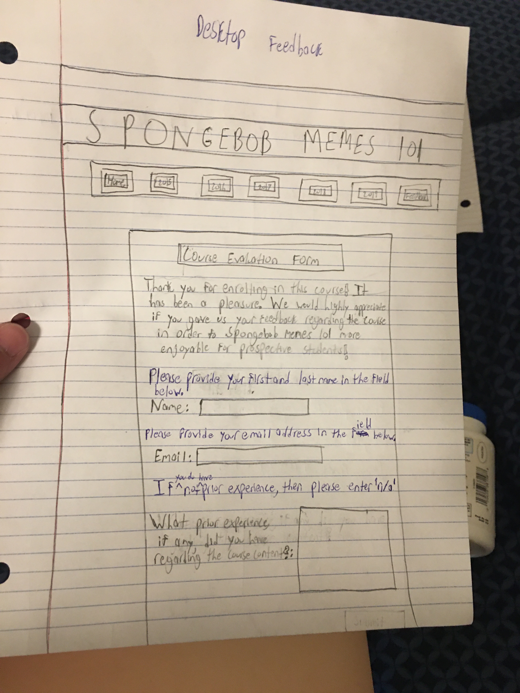
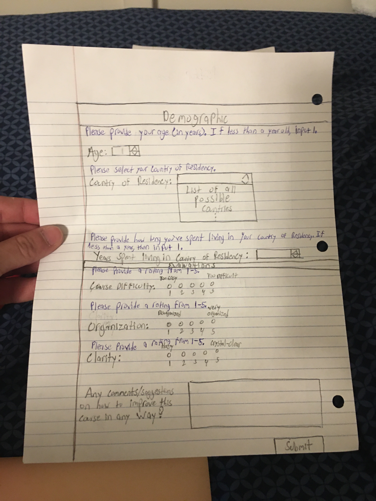

# Project 3 - Design Journey

Be clear and concise in your writing. Bullets points are acceptable.

## Planning, Design, & Evaluation

### Target Audience (Milestone 1)
> Who is your site's target audience? This should be the original target audience from Project 1 or Project 2.

My site's target audience is the latter half of Generation-Z Americans whom
seek to fit into the whole Spongebob memes craze but have never watched a single
episode of _Spongebob Squarepants_ in their life.


### Planning & Designing for User Input (Milestone 1)
> Determine what purpose the form for your site will accomplish, where it will go (physical placement on page and the HTML file name), and what form components you plan on using.


Purpose:

When planning and designing my form, I experienced great inspiration
from the course evaluation forms that Cornell makes students complete at the end
of academic semesters. Considering that my site is essentially a crash course, of
some sort, it would not be right if I did not obtain feedback from those "enrolled"
in the course. By doing so, I can know if the content that I have provided
is presented in the most thorough and concise manner. As you might have noticed,
the form is not as dense as the Cornell evaluation forms. I have intentionally
made the form as so for two reasons: one can complete my crash course in a matter
of minutes, and a shorter form will make people more susceptible to filling
in the "suggestions" text area. I cannot speak for everyone, but I generally do
not like filling out course evaluation forms; thus, when I finally reach the
writing sections, I tend to leave them blank. By shortening the length of the form,
the light-heartedness of the meme site is preserved and the probability of obtaining
feedback is higher.


 My form also contains a demographic section. I will be using this section to my
 advantage by seeing if the people enrolling in my course are indeed part of my
 target audience. This course is essentially open to all, but I have a particular
 audience in mind-- after all. I believe that the functionality of the demographic
 section is probably beyond the scope of this course and is probably more applicable
 in Analytics; however, I believe it is not at all a bad touch to the form, and
 the section also coincides with the demographic sections of many Cornell surveys/forms.


Location:  I believe that it would be best for me to create a separate page as
adding a form to any of the other pages would cause confusion due to disparity
between the form content and the content found in each respective memes page. The
file that I make shall be called "feedback.html".  


Form Components:
  - Name: text field; `<input type = "text">`
  - Email: email field; '<input type = "email">'
  - What prior experience, if any, did you have regarding the course content?:
    multi-lines text field; '<textarea rows = "" cols = ""></textarea>'

  Demographic Questions:
    - Age: number field; `<input type="number">`
    - Country of Residency; select box ; '<select> <option>Country</option>...</select>'
    - Years living in country of residency: number field; `<input type="number">`

  Evaluation:
    - Course Difficulty: radio button; `<input type="radio">`
    - Organization: radio button; `<input type="radio">`
    - Clarity: radio button; `<input type="radio">`
    - Any comments/suggestions on how to improve this course in any way?
      multi-lines text field;'<textarea rows = "" cols = ""></textarea>'

#### Update:
  - Reset: reset button; <button type = "reset">
  - Submit: submit button; `<input type="submit">`


> Include sketches on your form below. Include sketches of your **mobile and desktop** versions.

* My form was too big/long to draw, even with the use of a chalkboard, so I had to
make two separate drawings for both the mobile and desktop designs.

**Desktop Sketches**
#### A few notes/comments:
* I had only thought about what to write for the description when I was drawing
up the feedback design; thus, to know the exact description that I will be
using to introduce the form, look at the feedback designs for both desktop and
mobile.
* The amount of space allotted to each component/input is not going to be the
exact same in my actual implementation of the form; this is just a general idea/outline.

<!--Source: Original Work(Leonardo Leyva)-->

<!--Source: Original Work(Leonardo Leyva)-->


**Mobile Sketches**
#### A few notes/comments:
* I accidentally forgot to write the name of each of the pages in the nav bar.
* I accidentally forgot to include the scribbles, at least, to symbolize the
description that is supposed to be present at the top of the form.
* I accidentally forgot to write the labels over the radio inputs, which specified
what "1" and "5" meant for each rating.
* I had only thought about what to write for the description when I was drawing
up the feedback design; thus, to know the exact description that I will be
using to introduce the form, look at the feedback designs for both desktop and
mobile.
* The amount of space allotted to each component/input is not going to be the
exact same in my actual implementation of the form; this is just a general idea/outline.


<!--Source: Original Work(Leonardo Leyva)-->


<!--Source: Original Work(Leonardo Leyva)-->


> What submission method will your form use? GET or POST. Explain your reasoning.

The submission method that I use for my form will be POST because I only want
to receive each user's form once. If I were to use GET, then there would be
the possibility that I receive each user's input multiple times. Although the
more input the better, this saying does not apply if the only thing I am seeing
is the exact same input. In addition, I want my users to feel as if they can respond
openly in the course evaluation forms; it would be unethical of me if I were to
choose GET, thus making it possible for their responses to be shared around the
web-- with others.


### Determine the Form Validation Criteria (Milestone 1)
> For each control in your form, specify the validation criteria AND your reasoning behind the criteria.

-  Name
  - reasoning: Name is required simply because I want to know who is taking the
  course. Although I won't be able to know the "students" personally, I at least
  want to know their names. There should only be letters inputted in name;
  numbers and special characters do not belong there. What is a little problematic,
  however, is that I only specified the letters of a specific type of alphabet.
  Thus, users that may contain letters in their names that are distinct from
  the Roman Alphabet.  
  - required/optional: required
  - constraints: pattern = "[A-Za-z]"

-  Email
  - reasoning: Email is required because, along with name, it will be the main
    component that I use to make sure that the same person is not submitting
    multiple forms.
  - required/optional: required
  - constraints: n/a

-  What prior experience, if any, did you have regarding the course content?
  - reasoning: I am making this required because it is essential for me to know
  what type of knowledge the person submitting the form had prior to taking
  the "course." Even if they put 'n/a,' it is enough for me to know if individuals
  from my target audience are accessing the site or not.  
  - required/optional: required
  - constraints: n/a

-  Age
  - reasoning: Although I have a specific target audience, this website is open
  to everyone. Thus, the minimum that I am making age is 1, as anything less
  would be utterly impossible-- due to negative ages and child birth. Since the
  oldest human was 122, I am capping the age ceiling at 125.
  - required/optional: required
  - constraints: `min="1" max="125"`

-  Country of Residency
  - reasoning: This is another demographic question, in which I want to make sure
  that Americans are using my site. Simply by making this required, my users
  will be forced to pick a country.
  - required/optional: required
  - constraints: n/a

- Years living in country of residency
  - reasoning: This is yet again another demographic question, in which I
    am trying to see what kind of people are "enrolling" in my course. The minimum
    amount will be 1 year because 0 would imply that the person has not lived in
    their country of residency at all. I am capping this at 125 in the case that the
    person has lived in their country of residency for their whole life and is
    at the ripe old age of 122.
  - required/optional: required
  - constraints: `min="1" max="125"`

-  Course Difficulty
  - reasoning: Considering that this is a part of the actual evaluation, I
    require that the user give their personal rating from 1-5. Simply by making
    this required, they will have to make a decision.
  - required/optional: required
  - constraints: n/a

-  Organization
  - reasoning: Considering that this is a part of the actual evaluation, I
    require that the user give their personal rating from 1-5. Simply by making
    this required, they will have to make a decision.
  - required/optional: required
  - constraints: n/a

-  Clarity
  - reasoning: Considering that this is a part of the actual evaluation, I
    require that the user give their personal rating from 1-5. Simply by making
    this required, they will have to make a decision.
  - required/optional: required
  - constraints: n/a

- Any comments/suggestions on how to improve this course in any way?
  - reasoning: Despite of the fact that this is possibly the most important part
    of the whole form, I cannot force anyone to have a genuine suggestion/comment.
    Forcing the users to give a a suggestion/comment could result in insincere
    responses.
  - required/optional: optional
  - constraints: n/a

-  Submit
  - reasoning: Submit is needed to turn in the form to begin with. I do not
  have to give it any constraints or anything; it is an essential part of forms.
  - required/optional: n/a
  - constraints: n/a


#### Update:
- Reset
  - reasoning: Reset is convenient to have in order to clear all of the fields of
  a form and start clean.I do not give it any constraints or anything as not
  everyone necessarily needs to reset their form.
 - required/optional: optional
 - constraints: n/a


### Design Form Feedback (Milestone 1)
> Include sketches of your **mobile and desktop** _feedback_.

* My form feedback was too big/long to draw, so I had to make two separate drawings for
both the mobile and desktop designs.

**Desktop Feedback**

#### A few notes/comments:
* Please disregard any grammatical errors; the final product will be free of them
anyway.
* The amount of space allotted to each component/input is not going to be the
exact same in my actual implementation of the form; this is just a general idea/outline.

<!--Source: Original Work(Leonardo Leyva)-->


<!--Source: Original Work(Leonardo Leyva)-->



**Mobile Feedback**

#### A few notes/comments:
* Please disregard any grammatical errors; the final product will be free of them
anyway.
* The amount of space allotted to each component/input is not going to be the
exact same in my actual implementation of the form; this is just a general idea/outline.

<!--Source: Original Work(Leonardo Leyva)-->


<!--Source: Original Work(Leonardo Leyva)-->


### User Testing Plan (Milestone 1)
> Plan out your **one** task to evaluate your form.

Task: Given the assumption that you have no prior knowledge of _Spongebob Squarepants_--
which is actually true-- fill out the course evaluation form.


### User 1 - Testing Notes (Milestone 1)
> When conducting user testing, you should take notes during the test. Place your notes here.

<!--Source: Original Work(Leonardo Leyva)-->


### User 1 (Milestone 1)
> Using your notes from above, describe your user 1 by answering the questions below.

1. Who is your user 1, e.g., where user 1 comes from, what is your user 1’s job, characteristics, etc.?
My user is David. The following are characteristics/facts about him:
* 19 years old
* American Citizen (has lived in New York City for his whole life)
* Computer Science Major
* Sophomore at Cornell University
* Memes enthusiast
* Has never watched _Spongebob Squarepants_
* Constantly gets teased by my roommate and I for the lack of a childhood
* One of my two inspirations for making this meme website

2. Does your user 1 belong to your target audience of the site? (Yes)

> If “No”, what’s your strategy of associating the user test results to your target audience’s needs and wants? How can your re-design choices based on the user tests make a better fit for the target audience?


### User 1 - **Desktop** (Milestone 1)
> Report the results of your user 1 evaluation. You should explain **what the user did**, describe the user's **reaction/feedback** to the design, **reflect on the user's performance**, determine what **re-design choices** you will make. You can also add any additional comments. See the example design journey for an example of what this would look like.

- **Did you evaluate the desktop or mobile design?**
  - Pick one: desktop
- **How did the user do? Did they meet your expectation?**
  - The user was able to complete the task. I expected that the user would end
    up not filling out the "prior experience" input at all, and I was right.
    The test went perfectly as he eventually saw the feedback design and read
    the instructions regarding the section that he did not fill.
- **User’s reaction / feedback to the design** (e.g., specific problems or issues found in the tasks)
  - Although the following is relevant, the user read "101" as "lol." The user did
    find that there were a few grammatical errors, but they were my own. He seemed
    to be accustomed to the type of form that he completed. The user questioned
    what the scribbles, where the form description is supposed to be, were; I ended
    up showing him the actual description, however, as it was my own mistake.
- **Your reflections about the user’s performance to the task**
  - As I previously stated, I expected that the user would not fill in the particular
    section that corresponds to the scenario that he was a part of-- under the task.
    The main component of this test was to see if the feedback message was objective
    and concise-- and it was.
- **Re-design choices**
  - I believe that I should explicitly tell the users, aside from in the feedback,
    that the proper response for a lack of any prior experience is 'n/a.'
- **Additional Notes**
  - Despite of the fact that the user reacted as I expected, there is no guarantee
    that all users that have no prior experience will behave in the same way.
    Some might explicitly write that they have no experience at all, which would
    result in them never receiving the feedback for their incorrect response.


### User 2 - Testing Notes (Milestone 1)
> When conducting user testing, you should take notes during the test. Place your notes here.

<!--Source: Original Work(Leonardo Leyva)-->


### User 2 (Milestone 1)
> Using your notes from above, describe your user 2 by answering the questions below.

1. Who is your user 2, e.g., where user 2 comes from, what is your user 2’s job, characteristics, etc.?
My second user is named Yitzak. Here a few characteristics/facts about him:
* 20 years old
* American Citizen (born and raised in Los Angeles)
* Sophomore at Cornell University
* Biology Major with a Pre-Med track
* Enjoys memes as much as the next Generation-Z American
* Has never watched a single episode of _Spongebob Squarepants_
* My other inspiration for making this meme website
* Alongside Jackson, he also gets teased by me and my roommate for his lack of
a proper childhood


2. Does your user 2 belong to your target audience of the site? (Yes)

> If “No”, what’s your strategy of associating the user test results to your target audience’s needs and wants? How can your re-design choices based on the user tests make a better fit for the target audience?


### User 2 - **Mobile** (Milestone 1)
> Report the results of your user 2 evaluation. You should explain **what the user did**, describe the user's **reaction/feedback** to the design, **reflect on the user's performance**, determine what **re-design choices** you will make. You can also add any additional comments. See the example design journey for an example of what this would look like.

- **Did you evaluate the desktop or mobile design?**
  - Pick one: mobile
- **How did the user do? Did they meet your expectation?**
  - Although this user completed the task, he reacted in a manner different than
    what I experienced with the first user test: he explicitly stated that he
    had no experience with the content-- rather than leave the field blank
    and be directed to the feedback at the end. He responded accordingly for
    all of the other fields.
- **User’s reaction / feedback to the design** (e.g., specific problems or issues found in the tasks)
  - To my dismay, he also read "101" as "lol." Although this was the fault of
    my handwriting, I have to make sure that the text is clear and visible in
    my website. Some of text was too small for him to read, which was mostly due
    to my poor handwriting and my attempt to minimize the amount of pages needed
    for my drawings-- this will be addressed properly in HTML and CSS.
- **Your reflections about the user’s performance to the task**
  - Although this user reacted differently from the other user, I had expected
    that this would happen-- as shown in my decision in my re-design choice from
    the first user test. Everything else, besides the grammatical errors and
    my bad handwriting, seemed like it went well.
- **Re-design choices**
  - The re-design choice is the same as my response under the one from User Test 1
    as I had already anticipated this problem.
- **Additional Notes**
  - Given that the re-design choice is the same as the one under the first User Test,
    the rationale is the same.


### Design Changes (Milestone 1)
> Use the space provided here to document any design changes from testing.

- I believe that I should explicitly tell the users, aside from in the feedback,
  that the proper response for a lack of any prior experience is 'n/a.'
- Rationale: There is no guarantee that all users that have no prior experience
  will behave in the same way. Some might explicitly write that they have no experience
  at all, which would result in them never receiving the feedback for their incorrect response.


#### Update:
* Although not all of the design changes that I made were in response to Milestone 1,
here are the changes that I made following the first Milestone:

  Desktop:

  * The introductory paragraph of the form explains what all of the information
  from the form will be used for in order to garner the trust and support required
  to get people to actually submit the form.
  * I changed the way that the navigation bar looked like in order to eliminate
  horizontal scrolling and for the simple reason that it looked better than how
  I had planned in my original design.
  * The feedback messages have a _*_ at  the end in order to give emphasis to
  the messages.
  * I provided a placeholder in the first textarea in order to instruct people
  on what can be entered even if they don't have any experience/knowledge of
  Spongebob.
  * All the labels corresponding to the textareas will vertically appear before the textareas-- as opposed to horizontally. I believe that the form would look less awkward this way.
  * I added a reset button in order to get rid of the content placed in all fields and to hide the feedback messages again.

  <!--Source: Original Work(Leonardo Leyva)-->
  
  <!--Source: Original Work(Leonardo Leyva)-->
  


  <!--Source: Original Work(Leonardo Leyva)-->
  
  <!--Source: Original Work(Leonardo Leyva)-->
  


  Mobile:
  * The introductory paragraph of the form explains what all of the information
  from the form will be used for in order to garner the trust and support required
  to get people to actually submit the form.
  * I changed the way that the navigation bar looked like in order to eliminate
  horizontal scrolling and for the simple reason that it looked better than how
  I had planned in my original design.
  * The feedback messages have a _*_ at  the end in order to give emphasis to
  the messages.
  * I provided a placeholder in the first textarea in order to instruct people
  on what can be entered even if they don't have any experience/knowledge of
  Spongebob.
  * All the labels corresponding to the textareas will vertically appear before the
  textareas-- as opposed to horizontally. I believe that the form would look less
  awkward this way.
  * I added a reset button in order to get rid of the content placed in all fields
  and to hide the feedback messages again.


  <!--Source: Original Work(Leonardo Leyva)-->
  
  <!--Source: Original Work(Leonardo Leyva)-->
  


  <!--Source: Original Work(Leonardo Leyva)-->
  
  <!--Source: Original Work(Leonardo Leyva)-->
  


### Additional Information (Milestone 1)
> (optional) Include any additional information, justifications, or comments we should be aware of.

I can think of nothing to put in this section-- at the moment.

#### Update:
I do not think that I have to repeat the first round of user testing for the
updated designs that I came up with as most of the modifications made held no
relation to the type of tests that I conducted. Moreover, the placeholder that
I placed in the first textarea came as a result of the user testing.

---

## Polished & Tested Form

###  Plan Validation Pseudocode (Final Submission)
> Write your form validation pseudocode here

```
when DOM is loaded:

	when form is submitted:
		formValid <- true


		if name_input meets HTML5 validation criteria:
			hide name_input feedback
		else
			show name_input feedback
			formValid <- false

		if email_input meets HTML5 validation criteria:
			hide email_input feedback
		else
			show email_input feedback
			formValid <- false

    if experience meets HTML5 validation criteria:
      hide experience feedback
    else
      show experience feedback
      formValid <- false

    if age_input meets HTML5 validation criteria:
      hide age_input feedback
    else
      show age_input feedback
      formValid <- false

    if country_input meets HTML5 validation criteria:
      hide country_input feedback
    else
      show country_input feedback
      formValid <- false


    if duration_input meets HTML5 validation criteria:
      hide duration_input feedback
    else
      show duration_input feedback
      formValid <- false

    if rating_1 meets HTML5 validation criteria:
      hide rating_1 feedback
    else
      show rating_1 feedback
      formValid <- false

    if rate_1 meets HTML5 validation criteria:
      hide rate_1 feedback
    else
      show rate_1 feedback
      formValid <- false

    if rate_one meets HTML5 validation criteria:
      hide rate_one feedback
    else
      show rate_one feedback
      formValid <- false

  send form to server if formValid is true

  when the reset button is clicked:
    hide all of the feedback messages
```


### User Testing Plan (Final Submission)
> This should probably be the same task from your first round of testing unless you have a reason to change it.

Task: Given the assumption that you have no prior knowledge of _Spongebob Squarepants_--
which is actually true-- fill out the course evaluation form.


### User 3 - Testing Notes (Final Submission)
> When conducting user testing, you should take notes during the test. Place your notes here.


### User 3 (Final Submission)
> Using your notes from above, describe your user 3 by answering the questions below.

<!--Source: Original Work(Leonardo Leyva)-->


1. Who is your user 3, e.g., where user 3 comes from, what is your user 3’s job, characteristics, etc.?
My third user is named Anthony. Here a few characteristics/facts about him:
* 18 years old
* American Citizen (born and raised in Miami)
* Freshman at Cornell University
* Food Science Major
* Has never watched a single episode of _Spongebob Squarepants_; despite of that,
  he is an avid follower of the Spongebob Meme trends.

2. Does your user 3 belong to your target audience of the site? (Yes)

> If “No”, what’s your strategy of associating the user test results to your target audience’s needs and wants? How can your re-design choices based on the user tests make a better fit for the target audience?


### User 3 - **Desktop** (Final Submission)
> Report the results of your user 3 evaluation. You should explain **what the user did**, describe the user's **reaction/feedback** to the design, **reflect on the user's performance**, determine what **re-design choices** you will make. You can also add any additional comments. See the example design journey for an example of what this would look like.

- **Did you evaluate the desktop or mobile design?**
  - Pick one: desktop
- **How did the user do? Did they meet your expectation?**
  - The user had no trouble at all in completing the assigned task. The user
    found it even easier to complete my form than my first two users did.
- **User’s reaction / feedback to the design** (e.g., specific problems or issues found in the tasks)
  - The user said that my form was a "mini course evaluation form."
  - Responded well to the aesthetics of the feedback page (complementary colors)
  - Was amazed at the fact that I had created a drop-down list for all of the countries/places
  - Played around with the submit and reset buttons repeatedly due to the entertainment provided
    by the responsiveness of JavaScript
  - Placeholder was a good touch for the "Prior experience" textarea; otherwise,
    he would have left it blank or entered something else
- **Your reflections about the user’s performance to the task**
  - I am proud by the effectiveness of my feedback page. This is the first time
    that I have ever coded a form, alongside its responsiveness, from scratch--
    so I was a bit nervous as to how it would look like or work. The comparison
    to the evaluation form made my heart swell with pride as my form
    essentially is meant to be a "mini course-evaluation form."
- **Re-design choices**
  - Seeing as how the task I assigned was completed without any sort of delay or
    trouble, I believe that I do not have to re-design anything-- at least for now.
    Luckily, my design is currently working the way that I expect it to work; thus,
    I will just ride out this wave of success until the fourth User Test.
- **Additional Notes**
  - I explained my reasoning in the previous section


### User 4 - Testing Notes (Final Submission)
> When conducting user testing, you should take notes during the test. Place your notes here.

<!--Source: Original Work(Leonardo Leyva)-->


### User 4 (Final Submission)
> Using your notes from above, describe your user 4 by answering the questions below.

1. Who is your user 4, e.g., where user 4 comes from, what is your user 4’s job, characteristics, etc.?

My second user is named Charu. Here a few characteristics/facts about her:
* 19 years old
* American Citizen (born and raised in Los Angeles)
* Sophomore at Cornell University
* Computer Science major in College of Engineering
* Parents prohibited her from watching _Spongebob Squarepants_ while growing up
* Tried to rewatch the show at some point, but she was already biased against it-- plus she was already "too old" for it


2. Does your user 4 belong to your target audience of the site? (Yes)

> If “No”, what’s your strategy of associating the user test results to your target audience’s needs and wants? How can your re-design choices based on the user tests make a better fit for the target audience?


### User 4 - **Mobile** (Final Submission)
> Report the results of your user 4 evaluation. You should explain **what the user did**, describe the user's **reaction/feedback** to the design, **reflect on the user's performance**, determine what **re-design choices** you will make. You can also add any additional comments. See the example design journey for an example of what this would look like.

- **Did you evaluate the desktop or mobile design?**
  - Pick one: mobile
- **How did the user do? Did they meet your expectation?**
  - The user was able to meet my expectations by completing the assigned task
    in under five minutes. I have intentionally made the feedback page in a user-friendly
    manner in order to minimize any inconvenience as they simply give me a few minutes of
    their time in order to answer my questions.
- **User’s reaction / feedback to the design** (e.g., specific problems or issues found in the tasks)
  - "Easy to understand"
  - Quickly answered all of the questions without delay
  - "I'm digging the ocean colors!"
- **Your reflections about the user’s performance to the task**
  - Despite of the fact that this was genuinely my first time working with web responsiveness--
    as I was not able to complete project 2-- the user was able to complete this
    task easily and she even liked the way in which I designed the form.
- **Re-design choices**
  - Hallelujah! Seeing as how the last user was able to complete my task without
    any complications, I do not need to change my design. If something isn't broken,
    then one shouldn't try to "fix it."
- **Additional Notes**
  - I explained my reasoning in the previous section

### Design Changes (Final Submission)
> Use the space provided here to document any design changes from testing.

Luckily, based on the success from the second round of user testing, I did not have to make any
further design changes. My users were able to fill the form with ease and in the
manner that I silently expected them to fill the form.


### Additional Design Justifications (Final Submission)
> If you feel like you haven’t fully explained your design choices in the final submission, or you want to explain some functions in your site (e.g., if you feel like you make a special design choice which might not meet the final requirement), you can use the additional design justifications to justify your design choices. Remember, this is place for you to justify your design choices which you haven’t covered in the design journey. Use it wisely. However, you don’t need to fill out this section if you think all design choices have been well explained in the final submission design journey.

I believe that I have sufficiently explained all of my design choices throughout
the course of this project. The last major changes are labeled under "Update: ."
Alongside these changes, I have also provided the explanations behind the reason
for changing/redesigning different aspects of my feedback page.


### Self-Reflection (Final Submission)
> This was the first project in this class where you coded some JavaScript. What did you learn from this experience?

This was actually a fun project to do. I have no familiarity with JavaScript, but
I have programming experience in Matlab and Java. Although the JavaScript that I
have learned for this course has been specific to working with forms, I hope
to continue learning JavaScript and more of the back-end programming stuff! I
also learned about the different components of forms and ways in which one can
ensure that users enter proper and valid responses. My favorite part was
probably making the drop-down list for all the countries/places in the world!


> Take some time here to reflect on how much you've learned since you started this class. It's often easy to ignore our own progress. Take a moment and think about your accomplishments in this class. Hopefully you'll recognize that you've accomplished a lot and that you should be very proud of those accomplishments!

I listed out some of my most recent accomplishments in the previous response.
This is only the beginning of what I intend to do with JavaScript. I need to
further my knowledge of this material in order to expand my programming abilities.
